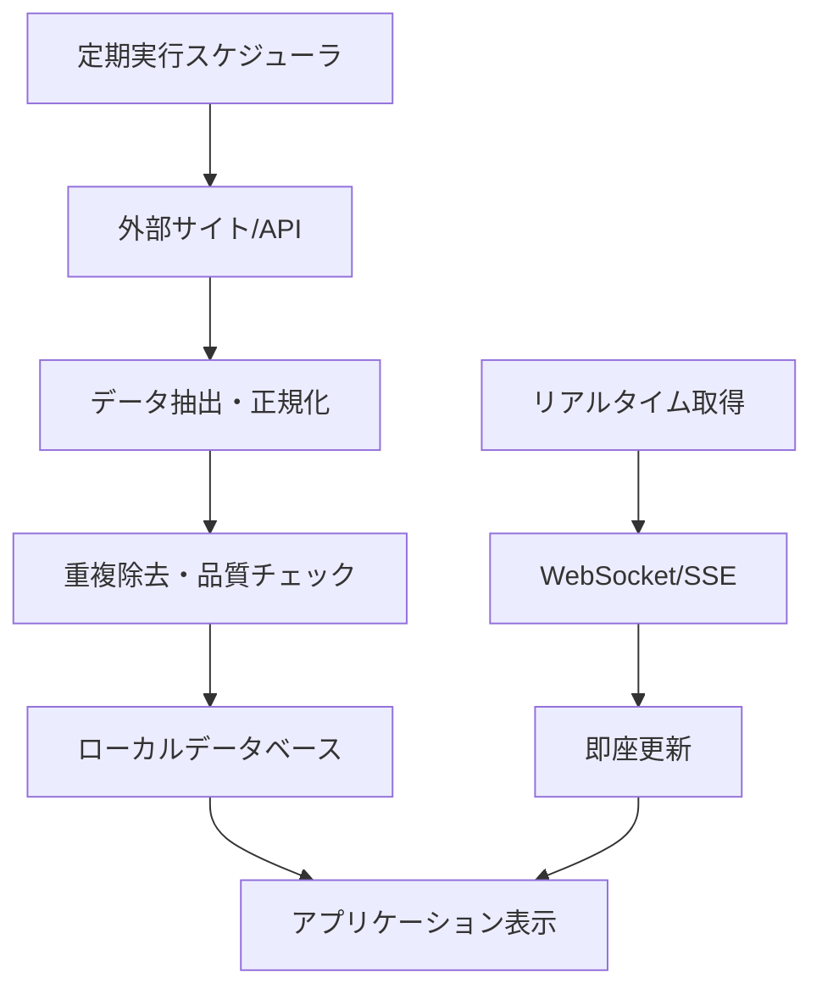

# PawMatch データクローリング・外部データ取得要件

## 概要

PawMatchは保護犬・保護猫とユーザーをマッチングするTinder風アプリケーションです。効果的なマッチングを実現するため、外部サイトからの動物情報、保護団体情報、関連データの取得が必要です。本ドキュメントでは、システムが必要とする外部データとその取得方法を定義します。

## 1. 保護動物データの取得

### 1.1 保護団体・動物愛護センター情報
**取得対象サイト**:
- 環境省 動物愛護管理室
- 各都道府県・政令指定都市の動物愛護センター公式サイト
- ペットのおうち（保護動物情報サイト）
- いつでも里親募集中
- LYSTA（動物愛護団体検索）
- 各NPO・保護団体の公式サイト

**取得情報**:
- 団体名、所在地、連絡先
- 営業時間、面会可能時間
- 保護動物の種類・頭数
- 譲渡条件、手続き方法
- 譲渡費用、ワクチン費用
- アクセス方法、駐車場情報
- スタッフ情報、獣医師在籍状況

**更新頻度**: 週1回（基本情報）、日次（在籍動物数）

### 1.2 保護犬・保護猫の詳細情報
**取得対象サイト**:
- ペットのおうち
- いつでも里親募集中
- 保護犬・保護猫の里親募集サイト
- 各自治体の動物愛護センター譲渡ページ
- 保護団体の個別サイト・ブログ
- Instagram、Facebook等のSNS投稿

**取得情報**:
```javascript
// 基本情報
{
  name: "動物名",
  species: "犬 | 猫",
  breed: "犬種・猫種",
  age: "推定年齢",
  gender: "オス | メス",
  weight: "体重",
  size: "小型 | 中型 | 大型",
  
  // 健康・医療情報
  health: {
    vaccination: "ワクチン接種状況",
    sterilization: "去勢・避妊手術済み",
    healthCondition: "健康状態",
    specialCare: "特別なケアが必要な事項",
    diseases: ["既往歴", "現在の病気"]
  },
  
  // 性格・行動情報
  personality: {
    friendliness: "人懐っこさレベル",
    activityLevel: "活動量（犬の場合）",
    sociability: "他動物との相性",
    training: "しつけ状況",
    specialNeeds: "特別な配慮事項"
  },
  
  // 犬専用情報
  dogSpecific: {
    exerciseNeeds: "運動量要件",
    walkFrequency: "散歩頻度",
    yardRequired: "庭の必要性",
    childFriendly: "子供との相性",
    otherDogFriendly: "他犬との相性"
  },
  
  // 猫専用情報
  catSpecific: {
    coatLength: "短毛 | 長毛",
    indoorOutdoor: "室内飼い | 室内外自由",
    multiCatFriendly: "多頭飼い適性",
    vocalLevel: "鳴き声レベル",
    activityTime: "活動時間帯"
  },
  
  // メディア情報
  media: {
    photos: ["写真URL配列"],
    videos: ["動画URL配列"],
    description: "詳細説明"
  },
  
  // 保護・譲渡情報
  rescue: {
    rescueDate: "保護日",
    rescueStory: "保護経緯",
    organization: "保護団体情報",
    adoptionFee: "譲渡費用",
    requirements: "譲渡条件"
  }
}
```

**更新頻度**: 日次（新規登録・状況変化の対応）

## 2. 犬種・猫種マスターデータの取得

### 2.1 犬種データベース
**取得対象サイト**:
- 一般社団法人ジャパンケネルクラブ（JKC）
- American Kennel Club（AKC）
- 各犬種専門サイト
- ペット情報サイト（アニコム、アイペット等）
- Wikipedia（犬種情報）

**取得情報**:
```javascript
// 犬種マスターデータ
{
  breedName: "犬種名",
  group: "犬種グループ",
  origin: "原産国",
  
  // 身体的特徴
  physical: {
    size: "小型 | 中型 | 大型",
    height: "標準体高",
    weight: "標準体重",
    coatType: "被毛タイプ",
    lifespan: "平均寿命"
  },
  
  // 性格・気質
  temperament: {
    activityLevel: "活動量（1-5段階）",
    exerciseNeeds: "運動要求量",
    trainability: "しつけやすさ",
    friendliness: "フレンドリーさ",
    guardDog: "番犬適性"
  },
  
  // 飼育要件
  care: {
    beginnerFriendly: "初心者向け度",
    apartmentLiving: "マンション飼い適性",
    childFriendly: "子供との相性",
    petFriendly: "他ペットとの相性",
    groomingNeeds: "グルーミング頻度"
  },
  
  // 健康情報
  health: {
    commonDiseases: ["一般的な疾患"],
    geneticConditions: ["遺伝的疾患"],
    healthScreening: "推奨健康診断"
  }
}
```

### 2.2 猫種データベース
**取得対象サイト**:
- 一般社団法人CFAジャパン
- The International Cat Association (TICA)
- 各猫種専門サイト
- ペット情報サイト
- 猫専門雑誌のオンライン版

**取得情報**:
```javascript
// 猫種マスターデータ
{
  breedName: "猫種名",
  origin: "原産国",
  
  // 身体的特徴
  physical: {
    size: "小型 | 中型 | 大型",
    weight: "標準体重",
    coatLength: "短毛 | 長毛",
    coatPattern: "毛色パターン",
    bodyType: "体型タイプ",
    lifespan: "平均寿命"
  },
  
  // 性格・気質
  temperament: {
    activityLevel: "活動量",
    sociability: "社会性",
    vocalLevel: "鳴き声レベル",
    affectionLevel: "甘えん坊度",
    independence: "独立性"
  },
  
  // 飼育要件
  care: {
    beginnerFriendly: "初心者向け度",
    indoorLiving: "室内飼い適性",
    childFriendly: "子供との相性",
    multiCatFriendly: "多頭飼い適性",
    groomingNeeds: "グルーミング頻度"
  },
  
  // 健康情報
  health: {
    commonDiseases: ["一般的な疾患"],
    geneticConditions: ["遺伝的疾患"],
    specialCare: "特別なケア要件"
  }
}
```

**更新頻度**: 月1回（マスターデータのため）

## 3. 動物飼育・ケア情報の取得

### 3.1 飼育ガイド情報
**取得対象サイト**:
- 環境省 動物愛護管理室
- 公益社団法人日本獣医師会
- アニコム損保 どうぶつ健康保険証
- ペット保険各社の情報サイト
- 動物病院の情報サイト

**取得情報**:
- 基本的な飼育方法
- 必要な用品・グッズリスト
- 健康管理・病気予防
- しつけ・トレーニング方法
- 応急処置・救急対応
- 年齢別ケア方法
- 季節別注意事項

### 3.2 法規・制度情報
**取得対象サイト**:
- 環境省 動物愛護管理法
- 各自治体の条例・規則
- 動物愛護団体の法的情報
- 弁護士事務所のペット法務情報

**取得情報**:
- 動物愛護法の最新情報
- 各自治体の条例・規則
- 飼育に関する法的要件
- 登録・届出の必要性
- 助成金・補助金情報
- ペット保険の法的位置づけ

**更新頻度**: 月1回（法改正等の対応）

## 4. 動物病院・関連施設情報の取得

### 4.1 動物病院データ
**取得対象API・サイト**:
- EPARKペットライフ
- カルーペット
- ペット予約システム各社
- Google Places API
- 各動物病院の公式サイト

**取得情報**:
```javascript
// 動物病院情報
{
  name: "病院名",
  address: "住所",
  phone: "電話番号",
  website: "公式サイトURL",
  
  // 診療情報
  medical: {
    hours: "診療時間",
    holidays: "休診日",
    emergency: "救急対応",
    specialties: ["専門分野"],
    equipment: ["設備情報"]
  },
  
  // 料金・サービス
  services: {
    fees: "料金目安",
    insurance: "ペット保険対応",
    grooming: "トリミングサービス",
    boarding: "ペットホテル",
    delivery: "往診対応"
  },
  
  // 評価・口コミ
  reviews: {
    rating: "総合評価",
    reviewCount: "口コミ数",
    features: ["特徴・強み"]
  },
  
  // 位置情報
  location: {
    latitude: "緯度",
    longitude: "経度",
    station: "最寄り駅",
    parking: "駐車場情報"
  }
}
```

### 4.2 関連施設情報
**取得対象サイト**:
- ペットホテル検索サイト
- トリミングサロン検索サイト
- ドッグラン情報サイト
- ペット用品店の店舗検索
- ペット保険会社の公式サイト

**取得情報**:
- ペットホテル、トリミングサロン
- ドッグラン、猫カフェ
- ペット用品店、ホームセンター
- ペット同伴可能な施設
- ペット保険会社情報

**更新頻度**: 週1回

## 5. 地域・エリア情報の取得

### 5.1 住環境データ
**取得対象API・サイト**:
- 不動産情報サイト（SUUMO、HOME'S等）
- 自治体の公式サイト
- Google Maps API
- 地域情報サイト

**取得情報**:
- ペット可住宅の相場情報
- 公園、散歩コース情報
- ペット同伴可能施設
- 地域のペット事情
- 交通アクセス情報
- 近隣施設（病院、店舗等）

### 5.2 自治体・行政情報
**取得対象サイト**:
- 各自治体の公式サイト
- 動物愛護センターの公式サイト
- イベント情報サイト
- 地域ポータルサイト

**取得情報**:
- ペット関連の条例・規則
- 各地域の動物愛護施策
- 譲渡会・イベント情報
- 相談窓口情報
- 地域別統計データ
- 災害時のペット対策

**更新頻度**: 週1回

## 6. リアルタイム・動的情報の取得

### 6.1 SNS・コミュニティ情報
**取得対象**:
- Twitter API（現X API）
- Instagram API
- Facebook API
- YouTube API（動物動画）
- Reddit API（ペット関連コミュニティ）

**取得情報**:
- 保護動物に関する投稿
- 里親募集情報
- 動物愛護に関する話題
- ペット飼育のヒント・コツ
- 地域のペット情報
- 緊急情報（迷子ペット等）

### 6.2 イベント・キャンペーン情報
**取得対象サイト**:
- こくちーず、Peatix（イベント情報）
- 保護団体のイベントページ
- ペット関連企業のキャンペーン
- 自治体のイベント情報

**取得情報**:
- 譲渡会・マッチングイベント
- 動物愛護イベント
- ペット関連キャンペーン
- 教育・セミナー情報
- ボランティア募集

**更新頻度**: 日次

## 7. 技術的実装方針

### 7.1 技術スタック
- **フロントエンド**: React + TypeScript
- **状態管理**: React Hooks + Context API
- **データ取得**: Fetch API + SWR
- **画像処理**: 画像最適化ライブラリ
- **ローカルストレージ**: IndexedDB

### 7.2 データ収集・処理フロー


### 7.3 データ品質管理
- **画像品質**: 解像度・ファイルサイズの最適化
- **情報精度**: 複数ソースでの情報照合
- **更新頻度**: データの種類に応じた適切な更新間隔
- **エラーハンドリング**: 取得失敗時のフォールバック

### 7.4 キャッシュ戦略
- **ブラウザキャッシュ**: 静的データの長期キャッシュ
- **メモリキャッシュ**: 頻繁にアクセスするデータ
- **ServiceWorker**: オフライン対応
- **CDN**: 画像・動画の配信最適化

## 8. セキュリティ・コンプライアンス

### 8.1 データ取得の法的考慮
- **robots.txt の遵守**: スクレイピング制限の確認
- **利用規約の確認**: 各サイトの利用条件
- **APIレート制限**: 適切なアクセス頻度
- **著作権の尊重**: 画像・テキストの適切な利用

### 8.2 プライバシー保護
- **個人情報の最小化**: 必要最小限の情報のみ取得
- **データ匿名化**: 個人特定情報の除去
- **同意取得**: ユーザーの明示的な同意
- **データ保持期間**: 適切な保持期間の設定

### 8.3 セキュリティ対策
- **HTTPS通信**: 暗号化通信の必須化
- **入力検証**: XSS・SQLインジェクション対策
- **CSP設定**: Content Security Policyの適用
- **セキュリティヘッダー**: 適切なHTTPヘッダー設定

## 9. 運用・監視

### 9.1 監視項目
- **データ取得成功率**: 各ソースの取得状況
- **データ品質**: 不正データ・欠損データの検出
- **パフォーマンス**: 取得・表示速度
- **エラー率**: 各種エラーの発生状況

### 9.2 アラート設定
- **データ取得失敗**: 重要なソースの取得失敗
- **品質低下**: データ品質の著しい低下
- **パフォーマンス劣化**: 表示速度の大幅な低下

### 9.3 定期メンテナンス
- **データクリーンアップ**: 古い・不要なデータの削除
- **インデックス最適化**: 検索パフォーマンスの改善
- **キャッシュクリア**: 定期的なキャッシュ更新

## 10. 実装優先度

### 高優先度（MVP）
1. **基本保護動物情報**: 名前、種類、年齢、性別、写真
2. **基本犬種・猫種情報**: 主要犬種・猫種の特徴
3. **保護団体基本情報**: 名前、所在地、連絡先

### 中優先度（フェーズ2）
1. **詳細動物情報**: 性格、健康状態、特別な配慮
2. **詳細犬種・猫種情報**: 飼育要件、相性情報
3. **動物病院情報**: 基本的な病院データ
4. **地域情報**: ペット可住宅、近隣施設

### 低優先度（フェーズ3）
1. **リアルタイムSNS情報**: 最新の投稿・話題
2. **詳細イベント情報**: 譲渡会、セミナー等
3. **高度な分析**: 地域別トレンド、予測機能
4. **多言語対応**: 外国人向け情報

このデータクローリング・外部データ取得要件により、PawMatchアプリケーションは豊富で正確な動物情報を提供し、最適なマッチングを実現できるようになります。